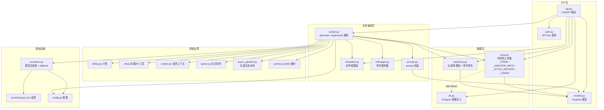
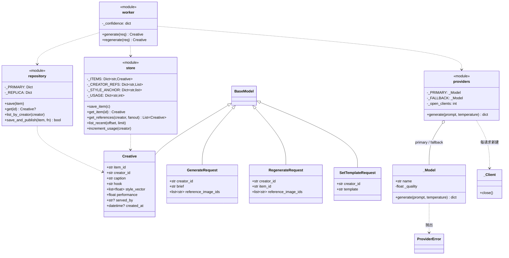
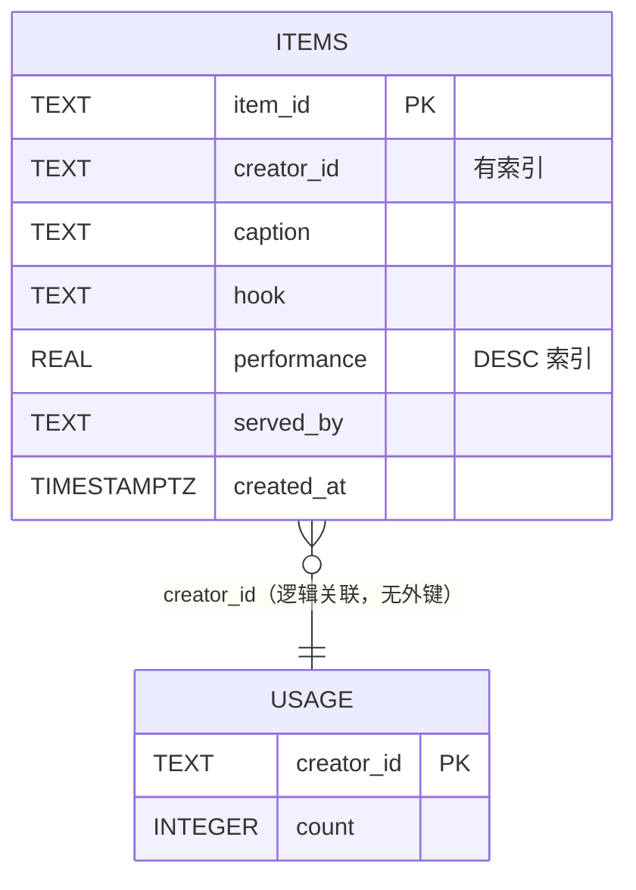
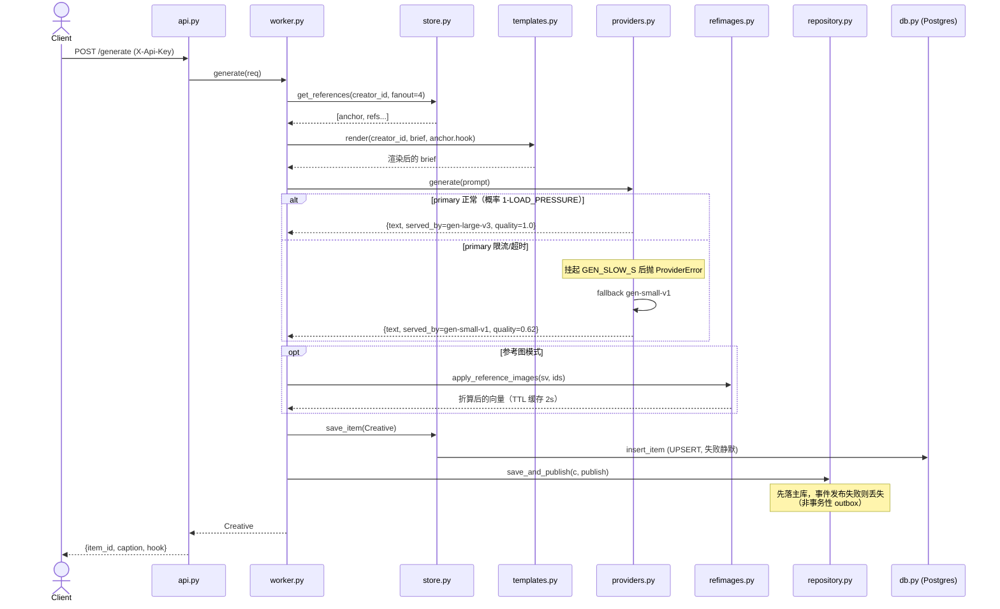
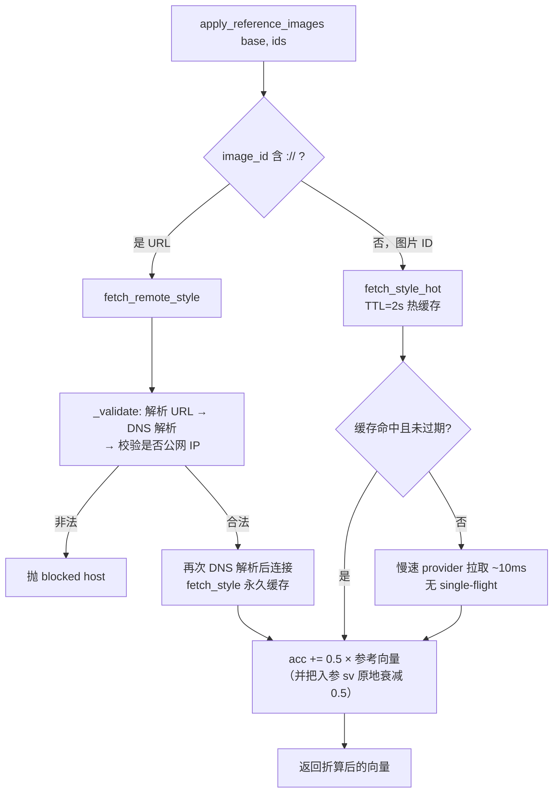

# creative-gen 架构分析文档

> 分析对象：`vibe-coding-bench` 仓库（`creative-gen` 内容生成服务）
> 代码规模：约 900 行 Python（`app/` 下 20 个模块）+ 静态前端 + Postgres
> 所有图均为 Mermaid，GitHub / VS Code / JetBrains 可直接渲染。

---

## 1. 项目概览

`creative-gen` 是一个面向创作者（creator）的**文案/创意生成服务**：

- 调用大模型（primary/fallback 双模型）根据 brief 生成 caption + hook；
- 为每个创作者维护**风格向量（style vector）与风格锚点（style anchor）**，使重新生成（regenerate）的结果保持创作者的个人风格；
- 支持**参考图模式（reference-image mode, VIZ-1240）**：把参考图的风格向量折算进创意的风格向量；
- 支持创作者自定义 prompt 模板（VIZ-1305）。

技术栈：

| 层 | 技术 |
|---|---|
| 前端 | 静态单页（`frontend/index.html`），nginx 托管并反向代理 API |
| 后端 | Python + FastAPI（同步 endpoint） |
| 持久化 | Postgres 16（`psycopg_pool` 连接池）+ 进程内内存结构（热工作集） |
| 部署 | docker compose（db / backend / frontend 三个服务） |

---

## 2. 部署架构

```mermaid
flowchart LR
    U[浏览器] -->|:8080| N[frontend<br/>nginx:alpine<br/>静态 SPA + 反向代理]
    N -->|"/generate /regenerate /template<br/>/items /creators /healthz"| B[backend<br/>FastAPI :8000]
    U -.->|直连 :8000 也可| B
    B -->|psycopg_pool<br/>DATABASE_URL| PG[(db<br/>postgres:16<br/>:5433→5432)]
    PG --- V[/pgdata volume/]
    PG --- I[/db/init.sql<br/>容器初始化脚本/]

    subgraph 外部依赖（生产中真实存在，代码里为模拟）
        M1[模型网关<br/>gen-large-v3 primary]
        M2[模型网关<br/>gen-small-v1 fallback]
        K[Kafka / SQS 事件总线]
        O[OTLP metrics collector]
        NT[通知服务]
    end
    B -.-> M1
    B -.-> M2
    B -.-> K
    B -.-> O
    B -.-> NT
```

要点：

- nginx 用路径正则把 6 个 API 前缀代理到 backend，其余请求回落到 `index.html`（SPA）。
- backend 通过环境变量注入 `DATABASE_URL`、`LOAD_PRESSURE`（主模型故障率，默认 0.35）、`GEN_SLOW_S`（主模型降级时的挂起时长）。
- `db.py` 设计为**可选依赖**：`DATABASE_URL` 缺失或连接失败时全部降级为 no-op，服务纯内存运行（离线测试用）。

---

## 3. 模块分层与依赖（组件图）



分层观察：

- **`worker.py` 是全局编排中心**，直接依赖 13 个模块，是理解业务的入口，也是耦合最重的点。
- **持久化是"三写"结构**：同一条 `Creative` 会被写进 ① `store._ITEMS`（内存热集，读路径主要来源）② `db`（Postgres 镜像，仅 `/healthz` 统计用到读）③ `repository._PRIMARY`（模拟主/副本，`/creators/{id}/items` 从副本读）。三者**没有统一的事务边界**，属于典型的双写/三写一致性隐患（见 §8）。
- `store.py` 模块注释自述"应用逻辑也住在这里"，数据层混入了引用挑选（`get_references`）、趋势记录等业务逻辑。

---

## 4. 数据模型（UML 类图 + ER）

### 4.1 类图



> 说明：本项目几乎全部状态以**模块级全局变量**承载（`<<module>>` 标注），而非类实例——这意味着状态天然是进程级单例，多 worker / 多副本部署时互不可见（见 §8）。

### 4.2 Postgres ER 图



注意：`style_vector`、`_STYLE_ANCHOR`、`_confidence` 等风格状态**只存在于内存**，不落库——重启即丢，风格连续性依赖进程存活。`usage` 表在代码中无人写入（`increment_usage` 只改内存）。

---

## 5. 核心流程：`POST /generate`

### 5.1 流程图

```mermaid
flowchart TD
    A[POST /generate] --> B{X-Api-Key 校验}
    B -->|失败| B401[401]
    B -->|通过| C[context.set_actor 记录当前创作者]
    C --> D[store.get_references<br/>取该创作者的参考创意<br/>+ 全局热门 exemplar 兜底]
    D --> E[templates.render<br/>按创作者模板渲染 brief]
    E --> F[prompt.build_prompt<br/>anchor 定声线 + 其余作风格示例]
    F --> G[providers.generate]

    subgraph 模型调用（含降级）
        G --> H{primary 是否被限流<br/>P=LOAD_PRESSURE}
        H -->|否| I[primary gen-large-v3<br/>quality=1.0]
        H -->|是| J[挂起 GEN_SLOW_S 秒后抛错] --> K[fallback gen-small-v1<br/>quality=0.62 文本更泛化]
        I --> L[monitoring.record ok]
        K --> L
    end

    L --> M[billing.charge 按字符计费]
    M --> N[util.vec_from_text<br/>文本→8 维风格向量×quality]
    N --> O{带 reference_image_ids?}
    O -->|是| P[refimages.apply_reference_images<br/>逐图取风格向量并折入]
    O -->|否| Q
    P --> Q[构造 Creative]
    Q --> R[store.save_item<br/>内存 + 镜像写 Postgres]
    R --> S[写 _STYLE_ANCHOR / increment_usage /<br/>cache.put last:creator]
    S --> T[repository.save_and_publish<br/>主库写入 + 发领域事件]
    T --> U[async_pipeline.post_generate<br/>warm trending + 同步通知 ~50ms]
    U --> V[queue.enqueue 后台队列]
    V --> W[返回 item_id / caption / hook]
```

### 5.2 序列图



### 5.3 `POST /regenerate` 的风格锚点机制


设计意图：多次 regenerate 时权重 `w` 饱和式趋向已建立的风格，避免漂移。副作用：`w→1` 后新生成内容对向量几乎无贡献，锚点**永久固化**（且 `_confidence` 全局字典只增不清）。

---

## 6. 参考图模式（VIZ-1240，本次 relaunch 的核心）



两级缓存：`_IMG_CACHE`（永久，key 为 `md5[:6]` 截断）与 `_HOT_CACHE`（TTL 2 秒）。README 明确要求 relaunch **不能回退延迟**，此路径正处在热路径上。

---

## 7. 横切设施

| 模块 | 职责 | 实现方式 |
|---|---|---|
| `auth.py` | API Key → tenant | 单一硬编码 key `sk_live_demo`，恒定返回 `tenant_default`（多租户尚未真正落地） |
| `monitoring.py` | 四个 9 SLA 错误预算 | 进程内计数器；`error_rate > 0.1%` 触发 page |
| `config.py` | 环境变量配置 + OTLP 指标初始化 | 模块导入时执行；exporter 不可达时打 error 日志继续运行 |
| `context.py` | 请求级"当前 actor" | 进程级 dict（非 contextvar） |
| `cache.py` | 对象缓存 | pickle 序列化，"以便日后迁移 Redis" |
| `queue.py` | 高峰期异步化 | 进程内无界 list；`retry()` 为无限 while 循环 |
| `billing.py` | 按输出字符计费 | `int(length × 0.07)` 取整 |

---

## 8. 架构风险与观察

这个仓库本身是一个诊断型面试题（README：输出在**劣化**、relaunch **不能回退延迟**），以下按架构视角归类我在梳理时观察到的结构性风险，供后续排查参考——**未逐一运行验证**：

**一致性 / 数据架构**

- 三份持久化（`store` 内存、`db` Postgres、`repository` 主/副本）无事务边界：`save_and_publish` 先提交后发事件，失败即丢事件（无 outbox）；`db.insert_item` 异常静默吞掉。
- 读路径分裂：`/items` 读 `store`，`/creators/{id}/items` 读 `repository` 副本（0.5s 复制延迟 + 逐条 `get` 的 N+1），刚写入的数据两个接口可见性不同。
- 全部核心状态是进程内全局变量：水平扩容或重启会直接破坏风格锚点、usage 计数与缓存语义；`increment_usage` 的 read-modify-write 在多线程下有竞态。

**质量劣化的可疑链路（对应"output degrading"）**

- `providers.generate` 把 fallback 成功也记为 `monitoring.record(ok=True)`：SLA 表盘全绿，但 `LOAD_PRESSURE=0.35` 意味着约 35% 流量由 quality=0.62 的小模型服务，且小模型渲染会丢弃短词（丢失 voice 线索）——**质量劣化对监控不可见**。
- `store.get_references` 把 id 列表放进 `set` 去重后再截断：**破坏了"anchor 必须排第一"的契约**（`prompt.build_prompt` 以第一个引用定声线），且 `_global_exemplars` 会把**其他创作者**的热门创意混入引用池，可能造成跨创作者的风格串扰。
- regenerate 的 `_confidence` 无上限增长使锚点固化；配合以上两点，风格会系统性漂移或僵化。

**延迟（对应"relaunch 不能回退延迟"）**

- primary 降级时同步挂起 `GEN_SLOW_S` 再走 fallback，无 fail-fast/熔断；endpoint 全部是同步 def，慢请求占满线程池。
- `refimages.fetch_style_hot` TTL 过期后无 single-flight，热点图过期瞬间会发生缓存击穿（stampede）；`_cache_key` 用 `md5[:6]` 截断，存在碰撞返回错误向量的可能。
- `async_pipeline.post_generate` 在 async 函数里调用同步 `time.sleep(0.05)` 的通知客户端；`worker` 又直接以同步方式调用它。

**安全**

- `templates.render` 将用户模板直接 `.format(ctx=_CTX)`：`{ctx.build_token}` 可泄漏内部字段（格式串注入）；`_NAME_RE = ^(a+)+$` 是典型灾难性回溯（ReDoS）模式。
- `refimages` 的 URL 校验先解析 DNS 验证、连接时**再次解析**——TOCTOU/DNS-rebinding 形态的 SSRF 面。
- `cache.py` 用 pickle 序列化（迁 Redis 后即为反序列化攻击面）；`auth.py` 硬编码 live key；`api.generate` 以 info 级日志记录完整 prompt（含创作者内容）。

**资源**

- `providers.generate` 每请求 new 一个 `_Client` 且 `finally: pass` 从不关闭（连接泄漏）；`queue.retry` 无退避无上限；`store.remember_brief` 的可变默认参数 `_seen=[]` 无界增长；`queue._QUEUE` 无界且无消费者。

---

## 9. 小结

`creative-gen` 是一个**单体 FastAPI 服务 + 模块级全局状态**的架构：API 层很薄，`worker.py` 承担全部编排，数据在内存热集、Postgres 镜像与模拟主/副本三处冗余存放。其核心领域概念是**风格向量/锚点体系**（生成 → 向量化 → 锚点混合 → 参考图折算），这也是 relaunch 的价值所在与延迟敏感路径。结构性短板集中在：多写不一致、全局可变状态、降级路径对质量监控不可见、以及参考图热路径上的缓存击穿与同步阻塞——与 README 描述的"输出劣化 + 延迟不能回退"两条主诉高度吻合，可作为排查的优先级依据。
